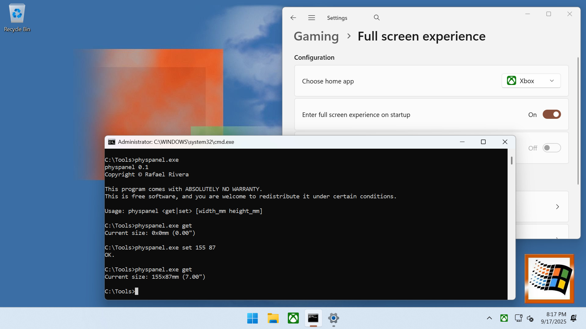

# Physpanel



A Windows utility to query and modify the internal panel dimensions reported by the system, useful for testing on Windows-based handheld gaming PCs. It works by reading and writing data to the Windows Notification Facility (WNF) state WNF_DX_INTERNAL_PANEL_DIMENSIONS normally set by `dxgkrnl.sys!DxgMonitor::EDIDCACHE::SetPhysicalDimensionOfInternalPanel` on handheld gaming (and other) PCs.

## Usage

### Scheduled task (recommended)

1. Open a shell as Administrator
2. Execute:
```
schtasks /create /tn "SetPanelDimensions" /tr "C:\path\to\physpanel.exe set 155 87" /sc onstart /ru SYSTEM /rl highest /f
```

### One-off via PSExec

1. Open a shell as Administrator
2. Execute:
```
psexec -s -i cmd.exe
```
3. In the Command Prompt, call `physpanel.exe` as needed.
4. (Optional) Sign-out/sign-in if you're testing full-screen experiences